# DynamicFX target architecture

> **Status: Approved target architecture for the unreleased rewrite**  
> **This document records the selected result, not alternative designs.**  
> **Brand name: DynamicFX. AE effect and match name: `DynamicFx`.**

DynamicFX 当前仍处于未发布开发阶段。本次选择直接重写现有 `DynamicFx`，不创建 `DynamicFx2`，也不为当前原型的参数顺序、`SourceChannel` 编码、flattened sequence v1-v3、legacy `SourceData` 或 sidecar 保留兼容负担。

[CONCEPT.md](CONCEPT.md) 和 [SHADER.md](SHADER.md) 描述重写前的原型现状；本文是重写后的唯一目标架构。竞品研究本身不随本仓库发布（[ADR-0036](adr/0036-single-repository-record.md)）；由它得出的采用/推迟/拒绝边界已并入本文和相关 ADR。

## Governance and implementation truth

- [Implementation status](IMPLEMENTATION_STATUS.md) is the only authority for what exists now and the next exact action.
- [Roadmap](ROADMAP.md) is the only authority for milestone order and exit criteria.
- [Test matrix](TEST_MATRIX.md) is the only authority for verification status.
- [Accepted ADRs](adr/README.md) preserve decision history and may only change through superseding ADRs.
- [Milestone audits](audits/README.md) collect visible evidence, limitations, residual risks, and reproduction.
- New sessions must begin with the repository root [CLAUDE.md](../CLAUDE.md).

## 1. 已确认的产品决策

| ID | 已确认结果 | 最终意义 |
|---|---|---|
| P1 | 开放 Shader Runtime | 核心价值始终是从 AE expression 读取 shader 并渲染，不转型为内容商店 |
| P2 | `Source.expression` 是权威输入 | 修改 expression 后及时重新编译；普通 AE 参数保持可关键帧化并参与每帧渲染 |
| P3 | 可扩展语言前端 | effect 面板提供不可关键帧化的 `Language` 下拉框，默认 GLSL；未来可追加 WGSL 等语言 |
| P4 | Editor 延后 | 当前不建设独立编辑器；未来 editor 也只是可选 writer |
| P5 | 不实现编辑期渲染策略 | AE 在手动编辑 expression 时负责锁定渲染；JSX 写入是一次性事务；插件只处理已提交 expression |
| P6 | 固定参数池 + Stable Param ID | 先使用 AE 原生参数把项目跑通，同时保证改序、改 label 和关键帧值尽量稳定 |
| P7 | 允许破坏性重写 | 项目未发布；保留 `DynamicFx` 名称，删除原型协议，不做旧项目迁移 |
| P8 | 画质正确性优先 | 高位深和 alpha/color 正确性优先于性能，再考虑 UI 功能 |
| P9 | Windows AE 2023-2026 | 统一 Windows 目标矩阵；Windows 跑通后再实现和验证 Apple Silicon macOS |
| P10 | Multi-pass 是核心能力 | `EffectDefinition` 第一版就是 render graph；single-pass 只是一个 pass 的特例 |
| P11 | 先做本地 Effect Package | 不做在线平台；未来可导入导出本地 definition package |

工程问题统一采用能最大化正确性、可测试性和可维护性的方案，不为了短期少写代码保留结构性缺陷。

## 2. 产品边界

### 2.1 DynamicFX 是什么

DynamicFX 是一个由普通 AE property 驱动的多语言、多 pass GPU shader runtime：

```text
Language popup + Source.expression + keyframeable AE parameters
                              ↓
                       EffectDefinition
                              ↓
                    validated RenderGraph
                              ↓
              compiled pass artifacts and pipelines
                              ↓
                          GPU render
```

### 2.2 DynamicFX 不是什么

核心 runtime 不依赖：

- CEP/UXP panel；
- WebSocket、proxy 或 sidecar；
- 云同步、账户、商店、授权或遥测；
- 外部文件持续存在；
- Premiere Pro 或 MediaCore 安装。

未来 editor、本地 package browser 或节点工具都只是 authoring client。保存进 AE project 的 definition 必须足以独立恢复和渲染。

## 3. 系统全景

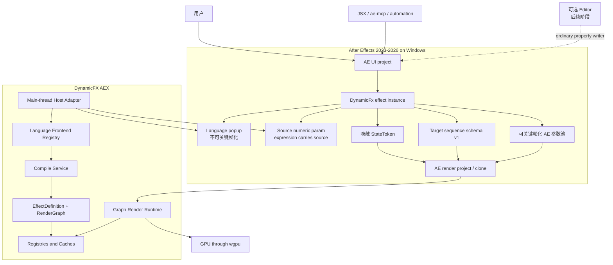

核心不变量：

1. `Language` 与 `Source.expression` 共同决定 shader definition；
2. 只有用户参数值可关键帧化，Language、Source transport 和内部状态不可关键帧化；
3. render project 不调用 AEGP；
4. editor、网络和外部 package 都不在必要渲染路径中。

## 4. AE 参数拓扑

重写后直接建立新的参数顺序，不保留当前原型 index。头部拓扑与池表由 [ADR-0013](adr/0013-paramid-grammar-and-pools.md) 固定：不存在 DefinitionData 参数，definition snapshot 只经 sequence 数据持久化（TR-M0-004 实测 arb 参数值写入路径无效）。

| 顺序 | 参数 | AE 类型 | 可关键帧 | 用途 |
|---:|---|---|---|---|
| 0 | Input | Layer | AE 固有 | 当前图层输入 |
| 1 | Language | Popup | 否 | 选择 language frontend，默认 GLSL |
| 2 | Source | Float Slider | 否；expression 可编辑 | expression 承载源码或 source envelope |
| 3 | Compile | Button | 否 | 明确请求重新观察/编译，主要用于诊断和参数 commit |
| 4 | Status | 只读式状态参数或受控 slider | 否 | 短状态和稳定错误码 |
| 5 | StateToken | 隐藏一维 primitive | 否 | UI/render clone 的原子 revision/status token |
| 6+ | 参数池 | Float/Integer slider、Checkbox、Color、Point、Angle | 是 | shader 参数和关键帧（池表见 ADR-0013） |

### 4.1 Language Popup

- 默认项为 `GLSL`；
- 枚举使用稳定 numeric ID，不能按显示名称持久化；
- 新语言只能 append，不能重排已有 ID；
- Language 改变后，使用同一份 `Source.expression` 交给新的 frontend 重新解析；
- Language 不是 shader 用户参数，不参与逐帧求值；
- 不支持当前 language 时保留 source，但状态为 Invalid 并透传。

### 4.2 参数池

v1 池表、容量与增长政策由 [ADR-0013](adr/0013-paramid-grammar-and-pools.md) 固定：

- Float / Integer / Bool（Checkbox）/ Color / Point 2D / Angle，共 104 槽；
- Popup 池在 v1 明确不存在：TR-M0-006 实测菜单和标签在 PARAMS_SETUP 后不可变，枚举参数映射为 Integer slider；
- Layer 额外输入属 M4 multi-input 扩展及其入口 ADR；
- Point 3D kind 保留未启用，待实机证据；
- 池增长只允许尾部 append，已发布 index 永不改类型、删除或重排。

容量写入单一配置源。任何 definition 超出容量时，整体拒绝，不静默丢弃后面的参数。

## 5. Source authority 与即时重编译

### 5.1 权威关系

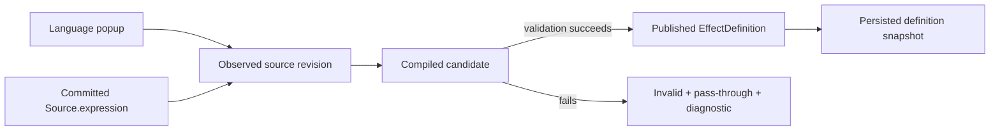

- `Language + Source.expression` 是用户意图和重新编译的唯一权威；
- persisted snapshot 用于 render clone、save/reload 和 registry reconstruction，不得覆盖已明确观察到的新 source；
- 参数关键帧值始终来自 AE parameter streams，不烘焙进 source 或 pipeline。

### 5.2 不实现编辑期 Last Good 策略

DynamicFX 不监听用户在 expression editor 中的逐字符中间文本，也不实现自己的“编辑锁”或 Last Good 显示模式：

- 手动编辑时由 AE 自身控制渲染锁；
- JSX/ae-mcp 写入 expression 是一次提交；
- 插件观察到提交后的 revision 后立即开始编译；
- candidate 成功后原子发布；
- candidate 失败后发布 Invalid，清除旧 definition 的可渲染资格并透传输入；
- 编译工作是否异步不改变上述可见语义。

### 5.3 及时观察

使用 event-first、idle-fallback：

1. AE 若发送 `UserChangedParam` / `UpdateParamsUi` / 合适 selector，立即观察；
2. expression-only script write 没有 selector 时，由 main-thread idle observer 发现；
3. idle interval 目标为 100-250 ms，并根据扫描成本自适应退避；
4. 维护已知 instance index，完整 project scan 只作为恢复 fallback；
5. Language 改变直接触发观察，不等待 project scan；
6. 同一 `Language + exact source` 不重复编译。

## 6. 可扩展语言前端

Language 不能被硬编码成 `GLSL/WGSL` 二选一。目标是注册表。

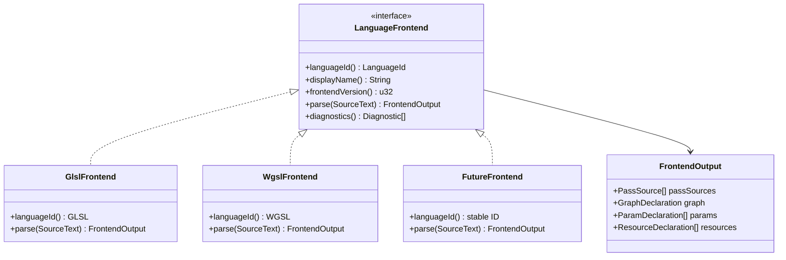

### 6.1 Frontend contract

每个 frontend 必须输出同一种中立模型：

```text
FrontendOutput {
  pass_sources,
  graph_declaration,
  parameter_declarations,
  resource_declarations,
  source_map,
  diagnostics
}
```

Frontend 不创建 AE 参数、不访问 GPU、不持有 AE handle，也不决定缓存。它只负责把所选语言和 source text 规范化为 `EffectDefinition` 的输入。

### 6.2 第一批 frontend

- `GLSL`：第一版、默认、完整支持；
- `WGSL`：注册表和测试框架完成后加入；
- 未来语言：必须有稳定 LanguageId、source mapping、ABI adapter 和完整测试，不能只把文本交给外部命令。

LanguageId 和 frontend version 进入 module identity。显示名称和 UI 顺序不进入 shader identity。

## 7. Multi-pass Source Envelope

Multi-pass 不能依赖独立 panel，因此一份 expression 必须可以表达完整 render graph。

### 7.1 兼容单 pass 的 envelope

- 普通裸 GLSL 表示一个默认 pass：`main -> output`；
- multi-pass 使用 versioned source envelope；
- envelope 与 Language 分离：Language 决定每个 pass source 的解析器，envelope 只描述 pass 边界、资源和连线；
- 识别标记（`@dynamicfx` 保留前缀）、版本 fail-closed 行为与尺寸上限（4 MiB committed source；8 MiB persisted snapshot 预算）由 [ADR-0012](adr/0012-source-envelope-marker-and-limits.md) 固定；
- 完整 grammar 在 M4 入口 ADR 固定，必须满足可读、可复制、可嵌入 JavaScript backtick、可安全限长。

推荐形态：头部 graph manifest + 命名 pass source sections。

```text
@dynamicfx 1
@graph
  pass blur_h: input -> temp_a
  pass blur_v: temp_a -> output
@end

@pass blur_h
  ...GLSL source module 1...
@endpass

@pass blur_v
  ...GLSL source module 2...
@endpass
```

这只是目标语义示例；正式 escaping、line mapping 和 grammar 必须由 parser tests 固定。

### 7.2 为什么 graph 必须从第一版存在

如果先把 definition 固定成单个 fragment module，后续 multi-pass 会迫使我们重写：

- persistence；
- identity；
- parameter scope；
- intermediate texture 生命周期；
- render cache；
- SmartRender/ROI；
- temporal feedback；
- MFR 资格判断。

因此 single-pass 只表示一个节点的 RenderGraph，而不是另一套 runtime。

## 8. EffectDefinition 与 RenderGraph

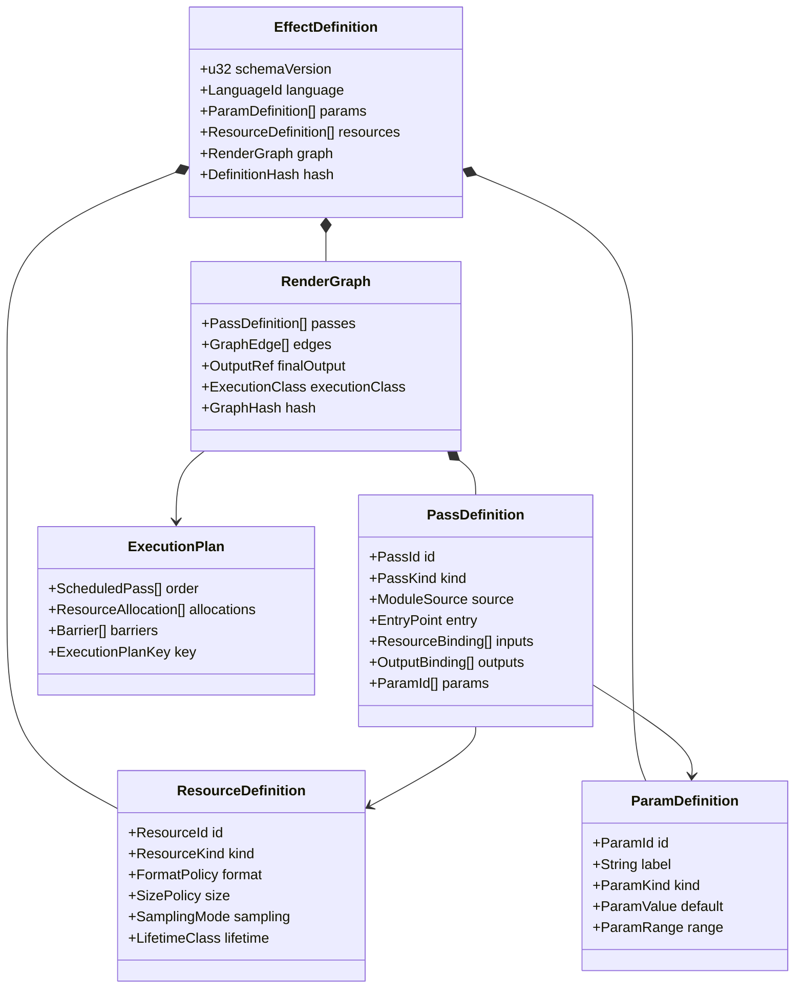

### 8.1 Pass 类型

第一版领域模型支持：

- Fragment render pass；
- Copy/resolve pass 作为 runtime-generated node；
- Mipmap generation node；
- History read/write node；
- future compute pass 预留 enum，但没有实现时 validator 必须拒绝。

### 8.2 Resource 类型

- AE layer input；
- intermediate transient texture；
- final output；
- static/noise auxiliary texture；
- history texture；
- future additional layer input。

### 8.3 图约束

- 同一帧内的普通边必须形成 DAG；
- graph 有且仅有一个 final output；
- resource 只有一个 writer，除非显式声明 merge pass；
- read-before-write、未绑定输入和 format mismatch 在编译阶段拒绝；
- temporal cycle 不能表现为普通 graph cycle，必须使用显式 HistoryResource；
- 单 pass graph 仍通过同一 validator、scheduler 和 executor。

## 9. Multi-pass 编译和执行

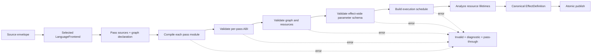

### 9.1 参数作用域

参数是 effect-wide stable IDs。Pass 只引用 ParamId，不拥有独立 AE slot。这样：

- 多个 pass 可以读取同一个关键帧参数；
- 参数改序不会改变 pass binding；
- 每帧只从 AE streams 读取一次 normalized values，再编码到各 pass uniform buffer；
- 不同 pass 可以拥有不同 reflected layout，由 BindingPlan 负责映射。

### 9.2 ExecutionPlan

编译阶段生成 immutable ExecutionPlan：

1. topological order；
2. 每 pass 输入/输出 binding；
3. intermediate resource lifetime；
4. 可 alias 的 transient texture；
5. history resources；
6. mipmap/copy 辅助节点；
7. 每 pass pipeline request；
8. final output route。

每帧不能重新分析 graph。

## 10. Temporal feedback

P10 的 multi-pass 包括 recursive feedback 等跨帧能力，因此必须明确 history 语义。

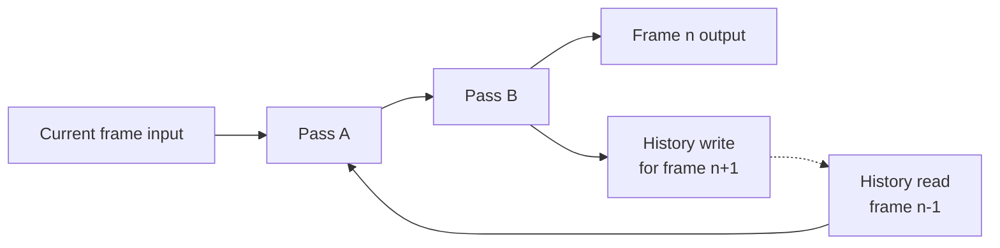

HistoryResource 必须在以下情况清空：

- definition 或 graph hash 改变；
- source/language 改变；
- comp time 非连续跳转；
- reverse playback；
- extent、pixel format 或 downsample 改变；
- AE purge/cache reset；
- project open；
- GPU device generation 改变；
- instance copy 后 identity 改变。

### 10.1 Determinism 与 MFR

RenderGraph 按执行类别标记：

- `Stateless`：只依赖当前帧，可以进入未来 MFR；
- `Temporal`：依赖 history，初始实现必须逐实例串行且不承诺任意帧顺序；
- `RandomAccessTemporal`：只有未来实现可重建 history/checkpoint 后才允许随机帧和 MFR。

第一版 Temporal graph 在非连续时间请求时清 history，从当前帧重新开始，Status/diagnostic 必须明确。不能假装递归效果在任意 aerender 分帧顺序下等价。

## 11. 参数绑定和关键帧

### 11.1 Stable Param ID

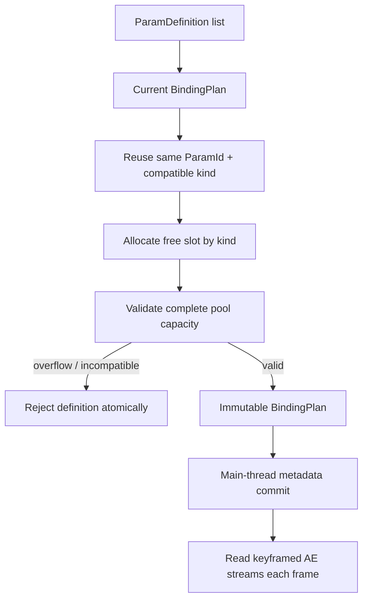

规则：

- explicit ParamId 是持久化身份；
- label、range 和 UI order 不改变 ParamId；
- GLSL annotation 没有显式 ID 时，uniform name 作为初始 ID；
- rename 只有显式 alias 才保值；
- kind 不兼容时分配新 slot；
- 删除的参数隐藏 slot；
- 整个 BindingPlan 校验完成后才修改 AE UI；
- 关键帧值不进入 DefinitionHash、ModuleHash 或 PipelineKey。

### 11.2 ValueState

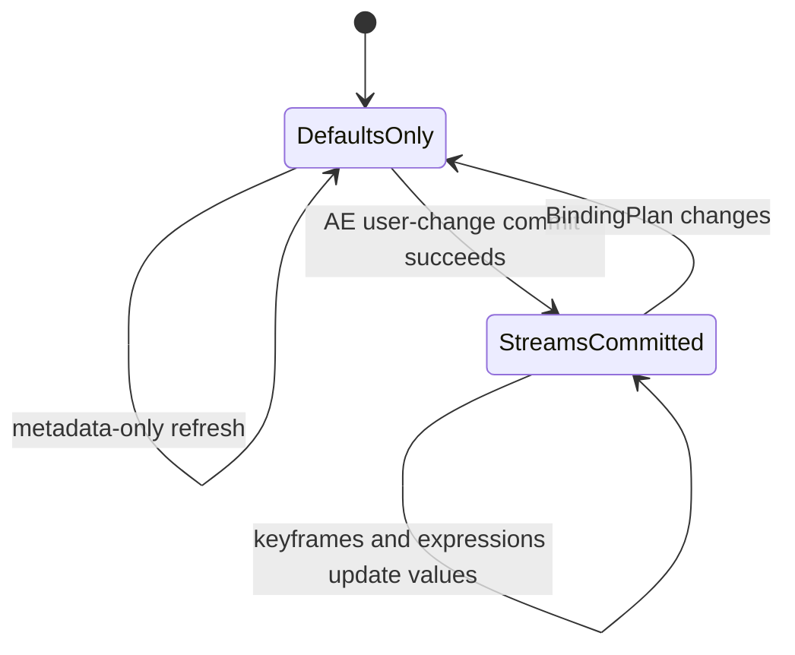

`DefaultsOnly` 时每个 pass 使用 ParamDefinition default；`StreamsCommitted` 后每帧读取 AE stream。这样避免尚未提交的参数池零值产生 NaN，同时保留正常关键帧渲染。

## 12. Compile transaction

不需要持久化 `CompileGeneration`。它只是当前 AE session 内防止异步结果乱序的事务号。

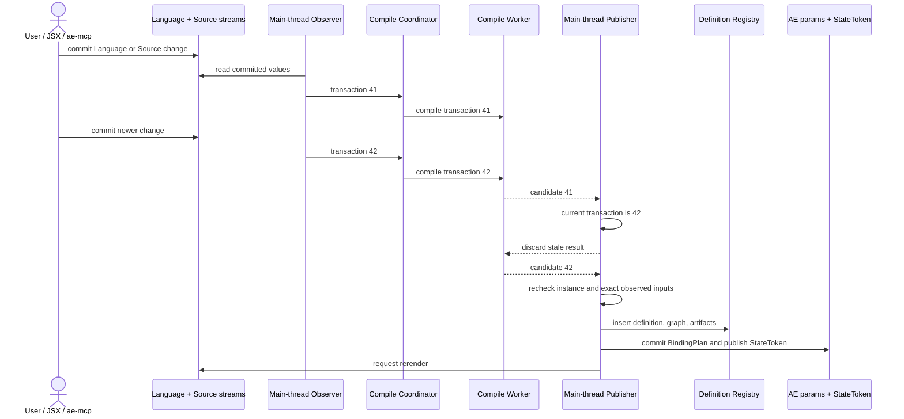

Compile worker：

- 不持有 AE handles；
- 可以并行编译不同实例/pass；
- 同一 module identity 去重；
- source size、pass 数量、graph 节点、resource 数量都有硬上限；
- panic/timeout 转换为当前 transaction diagnostic；
- transaction 结束后不写入 project state。

## 13. 新状态 transport 与 persistence

当前原型未发布，因此目标协议从 v1 重新设计，不保留当前 `SourceChannel`、SourceData 或 flattened v1-v3 decoder。

### 13.1 StateToken

隐藏一维 primitive `StateToken` 只承担 UI/render clone 的原子 revision/status handoff：

```text
StateToken = session-safe published revision + state bits
```

它不是完整 shader identity。完整 identity 和 definition 在 registry 与 sequence snapshot 中。

### 13.2 Sequence schema v1

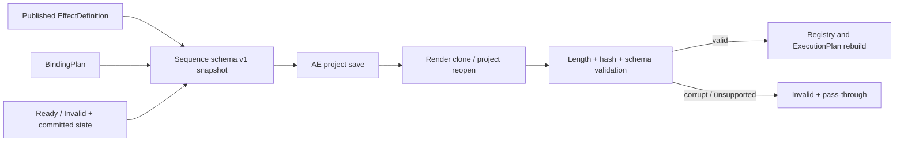

Snapshot 保存：

- schema magic/version；
- selected LanguageId；
- exact committed source envelope；
- canonical EffectDefinition；
- BindingPlan；
- module/graph/definition hashes；
- state and parameter-commit flag；
- payload lengths、checksum 和 limits。

Snapshot 不保存：

- compile transaction/generation；
- GPU modules；
- pipelines；
- transient textures；
- history frame contents；
- editor state。

### 13.3 Render clone resolution

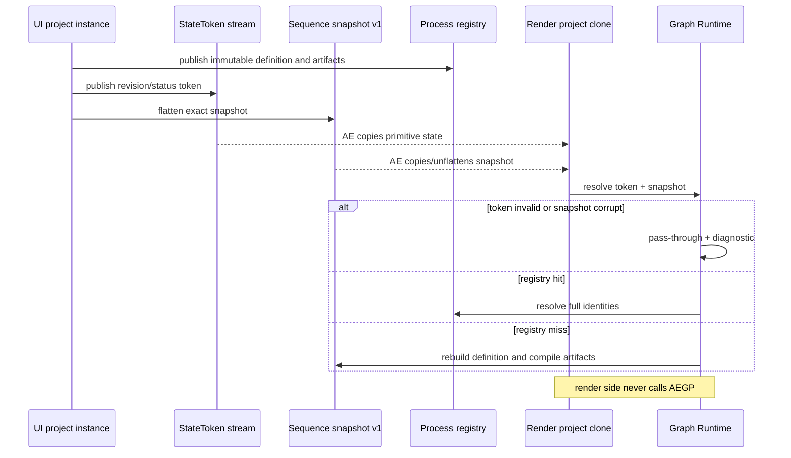

`DefinitionData` 的去留已由实机证据解决（[ADR-0013](adr/0013-paramid-grammar-and-pools.md)）：TR-M0-004 实测 arb 参数值写入路径无效，而 sequence flatten 可靠往返 16 MiB。目标拓扑不包含 `DefinitionData`；definition snapshot 的唯一持久载体是 sequence 数据（schema v1，尺寸预算见 [ADR-0012](adr/0012-source-envelope-marker-and-limits.md)）。

## 14. Identity 和缓存

UI metadata 改变不应该重建 GPU pipeline，因此不能直接用 DefinitionHash 作为 PipelineKey。

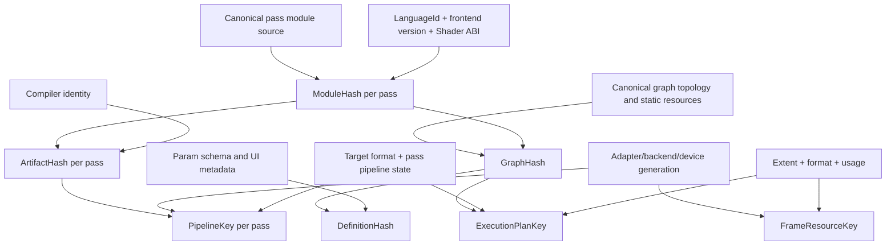

定义：

- `ModuleHash`：单 pass canonical source + LanguageId + frontend version + Shader ABI；
- `ArtifactHash`：ModuleHash + compiler backend/version/options；
- `GraphHash`：pass ModuleHashes + graph topology + static resource declarations；
- `DefinitionHash`：GraphHash + parameter schema + effect-level metadata；
- `PipelineKey`：ArtifactHash + pass pipeline state + target format + device generation；
- `ExecutionPlanKey`：GraphHash + resolved formats/extents/capabilities；
- `FrameResourceKey`：device generation + extent + format + usage/lifetime class。

关键帧值、label、UI order、`u_time` 和当前 frame number不得进入 PipelineKey。

## 15. Graph Render Runtime

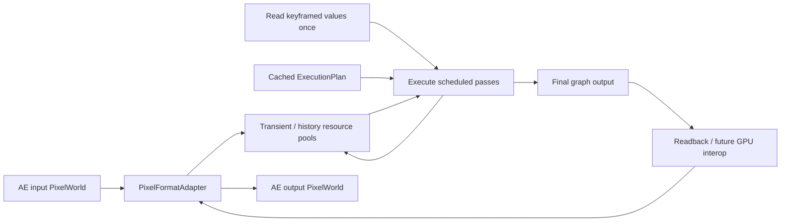

每帧 runtime 只做：

1. resolve EffectDefinition 和 ExecutionPlan；
2. 按 AE time 读取一次关键帧参数；
3. 取得 transient/history resource leases；
4. 按 schedule 编码所有 pass；
5. 一次或最少次数 submit；
6. 输出 final resource；
7. 回收 transient resources，保留 history resources。

不允许每帧重新 parse source、反射参数或拓扑排序。

## 16. Pixel formats 与画质优先级

| AE 输入 | 目标 GPU working format | 要求 |
|---|---|---|
| 8 bpc ARGB | `Rgba8Unorm` 或明确验证的 sRGB policy | 正确通道和 alpha |
| 16 bpc U15 | `Rgba16Float` | 不降到 8-bit |
| 32 bpc float | `Rgba32Float`；必要时显式能力降级 | 保留负值、超白和 alpha |

实现顺序：

1. 8/16/32 bpc pixel fixtures；
2. alpha/premultiplication 和 color policy；
3. multi-pass intermediate format propagation；
4. transient resource reuse；
5. SmartRender/ROI；
6. MFR；
7. GPU surface interop。

Multi-pass graph validator 必须阻止不兼容 format 的隐式连接，或者插入明确 conversion pass；不能在 pass 之间偷偷降精度。

## 17. GPU device 与资源生命周期

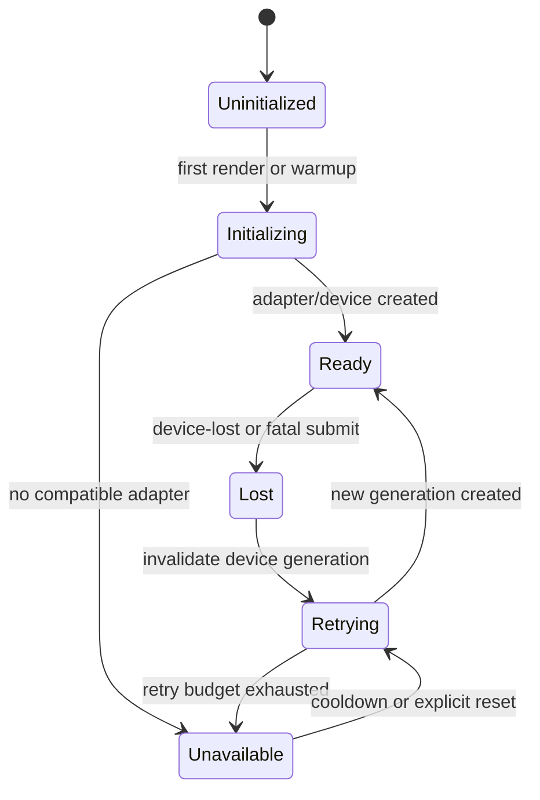

- 每次 device 创建成功递增 `DeviceGeneration`；
- PipelineKey、ExecutionPlanKey 和 FrameResourceKey 包含 generation/capability 影响；
- device loss 清除 pipelines、transient pools 和 temporal history；
- 初始化失败不能像当前 `OnceLock<Option<Gpu>>` 一样永久缓存；
- 使用 bounded cooldown，当前 frame 透传并记录 diagnostic；
- Windows backend 和 adapter 信息进入测试报告；macOS 实现时复用同一抽象。

## 18. 错误和诊断

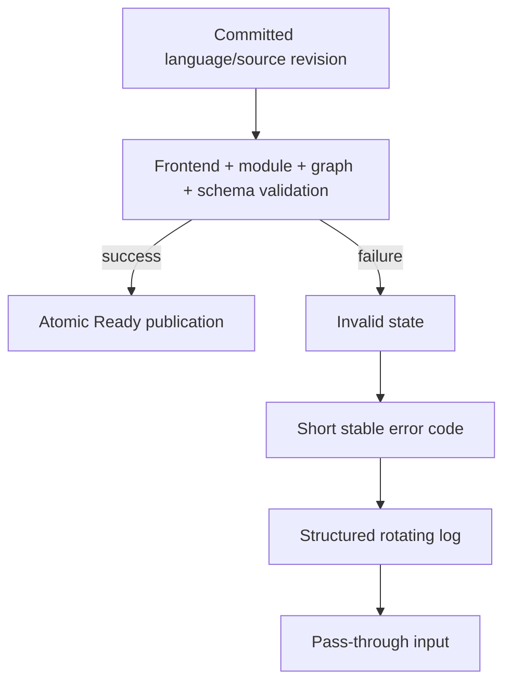

日志字段至少包含：

- plugin build；
- AE version；
- instance ID；
- LanguageId；
- compile transaction ID；
- pass ID；
- module/graph/definition hash 摘要；
- frontend/compiler phase；
- source line/column；
- adapter/backend/device generation；
- cache hit/miss；
- graph execution time 和每 pass timing；
- error code、chain 和最终动作。

默认不记录完整用户 shader source。日志 bounded rotation，ERROR 立即 flush。

## 19. Windows host matrix

目标发布矩阵统一为：

| Host | 开发目标 | 必须验证 |
|---|---|---|
| AE 2023 Windows | 支持 | load、params、expression、render、save/reopen、aerender |
| AE 2024 Windows | 支持 | 上述全部 + Manage Effects 行为 |
| AE 2025 Windows | 支持 | 上述全部 |
| AE 2026 Windows | 支持 | 上述全部 |
| macOS Apple Silicon | Windows 稳定后 | 独立实现、签名、公证和 Metal 验证 |

安装器改为显式接受 `2023|2024|2025|2026`，继续安装到各版本 `Support Files/Plug-ins/DynamicFx`，不使用共享 MediaCore。

不能因为同一 AEX 在某一个 host 加载，就推断其他三个版本受支持。每个版本维护独立测试记录。

## 20. 自动验收矩阵

| Area | Required scenarios | 结果要求 |
|---|---|---|
| Source | Language/Source 改变；expression-only JSX write；rapid consecutive commits | 最新事务原子发布，旧结果不覆盖 |
| Languages | GLSL 默认；unsupported ID；未来 WGSL；front-end version mismatch | 稳定选择和可操作诊断 |
| Single pass | raw GLSL 默认 graph | 与 multi-pass 同一 runtime |
| Multi-pass | chain、branch、merge、mipmap、format conversion | deterministic schedule 和正确输出 |
| Feedback | continuous frames、seek、reverse、purge、resize | history 按规则清理，不读陈旧资源 |
| Params | keyframes、expressions、rename、reorder、type change、overflow | Stable ID 保值，整体原子提交 |
| Add effect | 单次 `addProperty("DynamicFx")` | property tree 构造不失败 |
| Clone | UI/render project、registry hit/miss | render side 不调用 AEGP |
| Persistence | save/reopen、duplicate instance、corruption | schema v1 可恢复，损坏透传 |
| Formats | 8/16/32 bpc、alpha、负值、超白 | 不静默降精度 |
| GPU | no adapter、device lost、retry、cache invalidation | generation 隔离旧资源 |
| Hosts | Windows AE 2023/2024/2025/2026 + aerender | 每个 host 独立 PASS/FAIL |
| Performance | 4K、多实例、多 pass、history、cache pressure | 内存有界，timing 可观察 |

## 21. 实施阶段

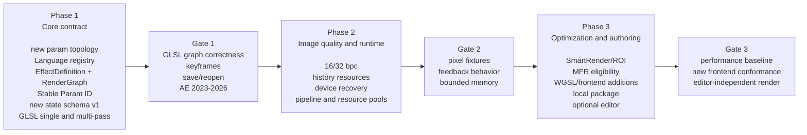

### Phase 1：Core contract

- 删除原型 legacy transport、sidecar 和 migration code；
- 新参数拓扑和 Language popup；
- LanguageFrontend registry；
- EffectDefinition、RenderGraph、Pass/Resource definitions；
- GLSL raw single-pass 和 versioned multi-pass envelope；
- graph validator/scheduler；
- Stable Param ID 和 BindingPlan；
- 新 StateToken + sequence schema v1；
- AE 2023-2026 regression harness。

### Phase 2：Image quality and runtime

- 16/32 bpc；
- alpha/color policy；
- transient/history resource managers；
- temporal invalidation；
- per-pass artifact/pipeline caches；
- device recovery；
- multi-pass performance instrumentation。

### Phase 3：Optimization and authoring

- SmartRender/ROI；
- stateless/temporal graph 的 MFR eligibility；
- WGSL 和其他 frontend；
- 本地 effect package；
- 可选 editor；
- Windows 稳定后 Apple Silicon macOS。

Multi-pass domain model、graph parser 和 executor 不是 Phase 3；它们从 Phase 1 就存在。

## 22. 建议代码边界

重写目标模块：

```text
src/
├── lib.rs                 # thin AE dispatch
├── host/
│   ├── params.rs          # new topology and main-thread commit
│   ├── observe.rs         # Language + Source observation
│   └── idle.rs            # indexed idle fallback
├── definition/
│   ├── effect.rs
│   ├── graph.rs
│   ├── pass.rs
│   ├── resource.rs
│   └── param.rs
├── frontend/
│   ├── mod.rs             # registry and trait
│   ├── envelope.rs
│   └── glsl.rs
├── compiler/
│   ├── coordinator.rs
│   ├── module.rs
│   ├── abi.rs
│   └── graph.rs
├── binding.rs
├── state.rs
├── persistence.rs         # new schema v1 only
├── registry.rs
├── gpu/
│   ├── device.rs
│   ├── pipeline.rs
│   ├── resources.rs
│   ├── history.rs
│   └── pixels.rs
├── render/
│   ├── planner.rs
│   └── executor.rs
└── diag.rs
```

先在单 crate 内形成依赖边界，不立即拆 workspace。

## 23. 实施前 ADR

架构方向已经确定。需要短 ADR 的格式细节如下——M0 前置项已全部 Accepted（0010 Language IDs、0011 Shader ABI v1 核心、0012 envelope 标记与尺寸上限、0013 ParamId 语法与池、0014 Windows 宿主协议），其余按 [ADR-0009](adr/0009-staged-format-adr-acceptance.md) 在 M3/M4/M6 入口 Accept：

1. Language Popup 的稳定 numeric IDs；
2. multi-pass source envelope grammar 和 escaping；
3. Shader ABI v1，包括 pass builtins、UV、time、resolution、frame index；
4. RenderGraph canonical serialization；
5. ParamId grammar、alias 和池容量；
6. StateToken 位布局；
7. sequence schema v1 binary codec、limits 和 checksum；
8. hash algorithm 和 domain separation；
9. intermediate/history format policy；
10. temporal seek/reset semantics；
11. ExecutionPlan resource aliasing规则；
12. Windows AE 2023-2026 build/install/test matrix。

接受时机按 [ADR-0009](adr/0009-staged-format-adr-acceptance.md) 分阶段安排：M0 只前置会被 M1 实现或从第一帧起可见的部分（Language ID、Shader ABI 核心、envelope 版本标记、ParamId 语法与池容量、宿主构建/安装/测试协议含 wgpu backend 策略）；其余在 M3/M4/M6 入口 Accept，在此之前保持 session-local、不得持久化。undo/redo 与 project-dirty 语义、稳定诊断码注册表并入 M3 的 StateToken ADR。M0 还要求先完成 expression transport 可行性 spike（TEST_MATRIX 的 TR-M0-002..TR-M0-007），其测量结果输入 envelope 尺寸上限、Popup 池可行性与 DefinitionData 去留决策。

## 24. 完成定义

架构完成不以“能运行一个 shader”判断，而以以下结果判断：

- 默认 GLSL 和 Language registry 正常工作；
- expression commit 后及时、原子地重新编译；
- 单 pass 和 multi-pass 使用同一 EffectDefinition/RenderGraph runtime；
- effect-wide 参数可关键帧化并在所有 pass 中一致读取；
- Stable Param ID 在改序和改 label 后保留值；
- save/reopen 和 UI/render clone 不需要 AEGP render-side 调用；
- feedback history 在 seek、purge、resize、source change 和 device loss 时行为确定；
- 8/16/32 bpc 不静默降精度；
- 每个 pass、pipeline 和资源缓存都有正确 identity；
- Windows AE 2023、2024、2025、2026 分别有可重复测试证据；
- 删除 editor、package 和网络后，AE project 仍可独立恢复和渲染。
