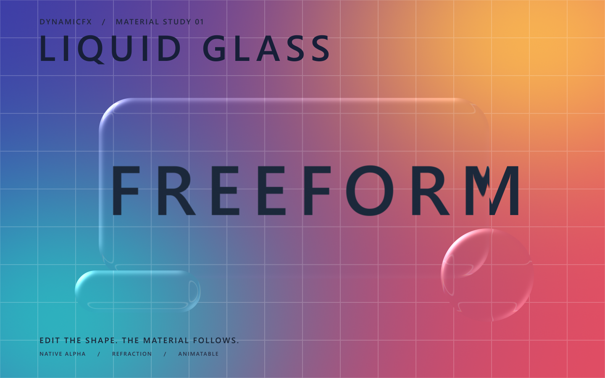

# Coverage completion, cancellation and Liquid Glass

Windows AE 2026 **26.5x89**, Rust **1.97.1**, 2026-09-23. The source base is
`922845c` with the recorded production overlay. The final pair is main
`6d188d2251fdecf89f18611fd429cbc4cd9b8c056dc3ad8f25dc35f74eca6a97` and reader
`29695b72fc8a26222a51319c3e42f86696b6d15e78efb02d968bc264ff173be6`.
The diagnostic AEX has been moved out of the host into the task's local backup.

## Verification

- `lifecycle/`: 18 helper mutation/recovery cases and 9 cleanup/foreign-reference/
  Undo cases. Four further parent/matte-reference cases are under `material/`.
- `fidelity/`: independently recomputed 174 native-alpha comparisons: the earlier
  114-case matrix plus 54 additional open-stroke/trim/offset/round-corner/disjoint/
  animated-mask/camera pairs and 6 WGSL pairs. Also 15 ROIs, empty output at all
  depths, warm-copy rejection/recovery and new/existing FFX rejection/recovery.
- `lifecycle/`, `mfr-*-v3`: 288 animated frame pairs, ordinary/adjustment ×
  8/16/32 bpc × 48 frames. Serial, concurrent and preceding correct output have
  identical digests of all native ARGB words (row padding excluded). MFR peaks
  are 10–12 overlapping callbacks, serial peaks 1; every run has 48 distinct
  images, balanced spans and zero coverage-gate errors. Diagnostic effects are
  absent from these projects.
- `postcancel/`: 18 native baseline/expanded pairs plus 15 ROI comparisons on
  the frame-owned-checkout implementation.
- `fidelity/preview-cancel*`: eight real preview/CTI interruptions produce two
  external-checkout cancellations that explicitly discard the frame. All 105
  surrounding cache-served PNGs match their purged re-renders, every channel
  exact. Foreground identity remains unchanged. These are exported PNG equality
  checks, separate from native-word precision checks.
- `fidelity/resources-*`: 330 existing GLSL/WGSL numeric checks, followed by
  217 checks after checkout repair: HDR, multipass, temporal replay, invalid-source
  refusal, Layer/Gradient/Path None/assigned values and keyframes/persistence.
- `material/`: 9 GPU depth/preview combinations; Amount=0 has zero float error;
  packed intermediate fields compare 256000 pixels with zero differing bytes at
  8 versus 32 bpc. Eighteen independent AE output frames cover 8/16/32 projects,
  Full/Half/Quarter and two animation times. Physical sizes are checked.
  Partial alpha is applied once (maximum measured error <0.0001), exterior and
  cutout pixels match the disabled effect exactly. A single FFX binds to a
  differently named arbitrary Bezier without selectors. Applying the script
  twice leaves exactly one effect. The clean editable project remains local.
- Final default/editor/no-SDK Rust suites each pass 254; reader suite passes 4.

## Repairs and retained failures

The initial helper move retained readiness. Static transform/timing/source
validation now rejects it and preserves modified objects. Shared-reference
dispatch (ADR-0057) removes exclusive Rust references to concurrent host state.
Frame-owned dependency IDs and successful-checkout guards (ADR-0058) propagate
cancellation and release resources on every exit.

The first MFR trace interleaved main/reader lines; separate diagnostic files fix
the evidence transport. The actual pixels already agreed. Ctrl+C terminated a
render process, and WM_CLOSE allowed a complete render: neither is called a
valid host-cancellation test. Only the later native preview test supplies that
proof. Camera property-name, Windows path/file-name encoding, PSD sequence-name,
and apply-script Source-label mistakes are retained with their corrected runs.

Gradient child controls were hidden until the effect panel opened. The idle
visibility path now exposes the bound live children, and direct script writes
pass without foreground interaction. On this host `saveFrameToPng` at 32 bpc
exports dark RGB even with glass disabled; native sampling and formal queue
output agree. The material was not brightened to compensate. The displayed PNG
is a lossless extraction of the formal PSD's channels.

The `a17d714b...` artifact ran the broad fidelity matrix; `675c2f51...` adds scoped
checkout cleanup and repeats all MFR pairs, targeted native geometry and existing
resources, plus real cancellation. `f6204e50...` adds only parent/matte ownership
guards and the example compile test. Final rebuilds normalize source license
attribution: `.text`, `.data`, unwind, resource and relocation sections remain
identical to the verified pair; the final bytes also receive a fresh independent
native render. Earlier hashes remain in installation records.

## Reproduction and publication scope

Run `spike/host-outline/verify-final-coverage.py` against this directory's
`fidelity` subdirectory. Native logs are losslessly gzipped. Harnesses and
normalized raw results are grouped by stage; paths and MCP artifact IDs are
redacted. `source/` freezes implementation and shader inputs; `manifest.json`
records content hashes. AEX, SDK, AEP, intermediate PSD and raw float arrays are
local build/test artifacts and are not published in this evidence directory.

This acceptance covers the new feature on the stated Windows host. It does not
invent new acceptance for older hosts or macOS. The already documented Source
Undo limitation remains separate. Publication is limited to the development
branch; no main merge or release-tag/asset update is authorized by this record.
