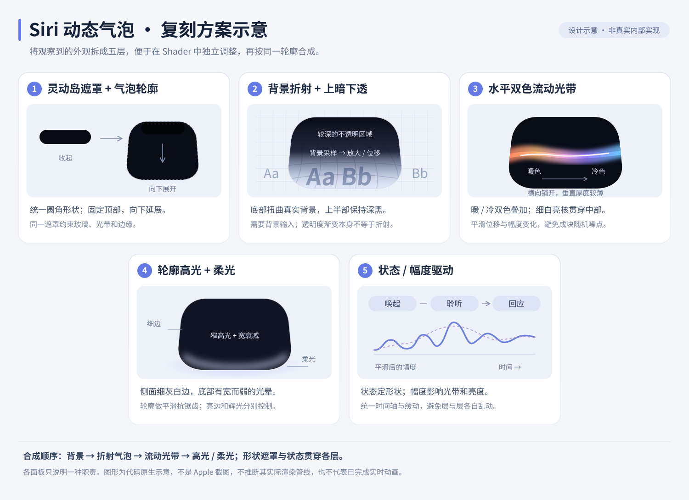

# iOS 27 Siri 动效拆解与 Shader 复刻方案

研究日期：2026-09-08。前一批 macOS、画质和 WGSL 工作已按各自范围完成，见 [当前状态](../IMPLEMENTATION_STATUS.md)。本篇是随后独立开展的视觉研究与实现设计，**没有把一个尚未实现的新 Shader 标成复刻完成**。

**复刻重点是“灵动岛附近的可变形玻璃气泡＋内部薄光带＋背景折射＋协调的入场运动”。** 仓库现有 [siri-glow.glsl](../../examples/siri-glow.glsl) 是早期发光边框方向的画质练习；它的覆盖计算、噪声过滤可以复用，构图与材质需要重新设计。

## 参考与证据边界

Apple 在 2026-06-08 正式预览 Siri AI；当前页面仍标记 iOS 27 Preview，Siri AI 英文版计划年内提供。本文锁定的是这组官方预览素材，不把它等同于所有 Beta 或未来正式版的最终样式。[iOS 27 官方页](https://www.apple.com/os/ios/)、[Siri AI 发布说明](https://www.apple.com/newsroom/2026/06/apple-introduces-siri-ai-a-profoundly-more-capable-and-personal-assistant/)

直接视觉参考是官网 Highlights 中的 [5 秒原始演示视频](https://www.apple.com/105/media/us/os/ios/2026/bad01e25-5b06-4708-86fc-0d5efd26b715/anim/highlights-siri/large_2x.mp4)。地址从当前页面 `video.currentSrc` 读取；通过浏览器视频进度条定位，实际查看画面，并读取播放器 `currentTime` 核对时间。没有下载或重新发布 Apple 视频。

| 片内时间，秒 | 实际看到的内容 |
|---|---|
| 0 | 黑色灵动岛胶囊 |
| 0.1537 | 外形向下膨大，内部光较暗 |
| 0.2548、0.3560、0.4773 | 气泡成形，横向彩色光带变亮；下方日期在泡内被放大、弯曲 |
| 1.1853、2.2006 | 主体轮廓接近稳定；光带的暖冷色区、上下位置发生变化 |
| 3.0461、4.3204、4.9677 | 壳体保持，内部亮核和色带继续变化 |

这些是播放器时间与离散帧观察，不是逐帧拟合曲线。片段没有完整展示退出、回答卡展开、聆听与思考的切换，不能给这些动作编造实测时长。接近 0.25 秒的底部比后续姿态略低，可作为测量回弹的线索，尚不足以声称测得弹簧参数。完整交互还有灵动岛下滑入口和对话界面，可参考 [Apple 发布说明](https://www.apple.com/newsroom/2026/06/apple-introduces-siri-ai-a-profoundly-more-capable-and-personal-assistant/) 及 [WWDC26 官方短片](https://developer.apple.com/videos/play/wwdc2026/121/)。

以下所有 SDF、光带、透镜和 Pass 描述都是**我们的拟合方案**。Apple 没有在这些资料中公开对应渲染源码或实际算法。一般 Liquid Glass 文档也不能证明某个 Siri 画面使用特定折射模型。

## 建议分成七个可独立调试的部分



| 部分 | 视觉作用 | 在 DynamicFX 中如何实现 |
|---|---|---|
| 1. 固定硬件遮罩 | 保持原始灵动岛黑区与位置 | 用独立固定胶囊遮罩保留背景中的硬件区域；不要随玻璃一起拉伸摄像头 |
| 2. 可变形外壳 | 从扁胶囊长成更高的圆角气泡 | 圆角矩形／胶囊 SDF；宽、高、圆角、中心纵移分别控制；一个 Morph 曲线驱动协调变化 |
| 3. 上暗下透的材质 | 上半黑，下半仍能看见背景 | 纵向透射渐变与暗色吸收；不要用全气泡统一黑色透明度 |
| 4. 背景透镜 | 日期文字在内部放大和弯曲 | 从输入背景采样，中心放大映射叠加边缘法线偏移；用参考文字的位移调参数 |
| 5. 内部薄光带 | 水平展开的暖冷双色波、白色亮核 | 少量带包络的连续曲线光带，叠加宽柔光；先用两条光带拟合，再决定是否需要低频噪声 |
| 6. 边缘与外部柔光 | 细窄高光、下方柔和亮区，增加体积感 | 轮廓覆盖、方向性边缘高光、独立的平滑衰减光晕；光带和高光不要共用一个阈值 |
| 7. 动作编排 | 外形、透射、光带亮度协调出现；稳定后内部持续运动 | AE 时间线提供 Morph、Intensity、Phase、Amplitude；每项采用可单独对齐的连续曲线 |

七个部分是调试与控制维度，不意味着七个渲染 Pass。对话文字、卡片排版、输入框属于后续 UI 合成层，应交给 AE 文本和形状图层。

## 实现顺序与数学模型

### 先做无色几何，确定外形和节奏

以 `p = v_uv * u_resolution` 建立逻辑像素坐标。当前 `vec2` Point 控件传入的是归一化坐标，因此先用 `centerPx = Center * u_resolution` 转换；尺寸和半径也统一为逻辑像素。圆角矩形距离可以写成：

```glsl
vec2 q = abs(p - centerPx) - halfSize + radius;
float d = length(max(q, 0.0)) + min(max(q.x, q.y), 0.0) - radius;
float aa = max(fwidth(d), 1e-5);
float cover = clamp(0.5 - d / aa, 0.0, 1.0);
```

`halfSize` 与 `radius` 保持合法关系。入场控制 `m` 同时改变尺寸和中心位置，但分别使用可调整曲线；不要直接把一张气泡纹理整体缩放。固定硬件遮罩独立计算。若后来加入不对称形变，距离函数可能不再是严格 SDF，覆盖仍须根据实际函数导数评估。

先对齐轮廓的宽、高、最低点和位置随时间的变化，再测是否需要超调。可从单调的缓入缓出曲线开始；有证据后再拟合阻尼回弹。0.15/0.25/0.36/0.48 秒可作为第一轮比较点，不能把营销视频的片头时间直接当作系统响应延迟。

### 再做透镜，使用可辨认背景定位误差

背景必须通过 `input` 或 `hint:layer` 输入，透明覆盖层不会自动获得 AE 已经合成在它下方的内容。可先把背景和日期预合成，再对该背景应用效果。

一个可调的起点是局部坐标 `q=(p-centerPx)/halfSize` 下的径向缩放：

```text
sourcePosition     = centerPx + (p - centerPx) * (1 - magnify * lensWeight(q))
edgeDisplacementPx = edgeDisplacement(q)
sourceUV           = (sourcePosition + edgeDisplacementPx) / u_resolution
```

`lensWeight` 平滑变化，`edgeDisplacement` 由近似表面高度的梯度／法线给出，输出逻辑像素位移；采样源坐标向中心靠近会产生放大。中心放大和轮廓折射应能分别调节。先用字母、直线网格调到正确位移，再加入轻微颜色和高光。不要一开始用强模糊遮盖错误：官方参考中的日期仍有清晰结构。

透镜只作用于玻璃覆盖区，下半保留较多透射，上半逐渐暗化。保护固定硬件区。是否需要色散，要看通道位移是否能在原始素材中稳定辨认；彩色光带本身不能证明存在强 RGB 色散。

### 内部光带先用有结构的函数

单条光带可用“弯曲中心线＋垂直厚度＋横向包络”：

```text
centerY(x,t) = offset + a1*sin(k1*x + phase1(t)) + a2*sin(k2*x + phase2(t))
ribbon      = exp(-0.5*((y-centerY)/thickness)^2) * horizontalEnvelope(x)
```

暖色与冷色光带有各自的相位、厚度和亮度；相交处形成较白亮核。另加更宽、更暗的能量分布形成柔光。主形态是扁而横向铺开的发光片，不能用若干圆形彩色噪点代替。

第一版不需要大量 fBm，也不需要流体模拟。若两条简单光带显得机械，再加少量稳定低频形变，并把它与最终抖动噪声分开。用连续时间推进相位，避免逐帧随机；循环要求所有周期首尾一致。宽窄光带各自做像素足迹处理，不能靠最后一遍模糊修补。

### 最后合成材质与柔光

先得到折射后的背景、暗化／透射结果，再叠加内部光场和轮廓高光，最后处理覆盖与外部柔光。需要在当前 AE 工作空间下校准亮度；不要凭目测随意插入 gamma 变换。

在覆盖层输出场景中，按明确的 straight/premultiplied 合成约定计算颜色与 alpha，避免细边乘两次 alpha 形成黑缝。彩色 halo 不能越过紧裁剪的图层边界；用足够大的预合成／全画幅背景，或在确实需要扩边时使用已有 `hint:canvas`。

## Pass 与参数设计

**第一版采用 1 Pass**：背景采样、透镜偏移、外壳覆盖、薄光带、高光和解析柔光都在同一片元阶段完成。当前 GLSL 路径已能表达，不需要先接入 WGSL。

只有实测需要宽范围背景模糊或复杂光场扩散时再加 Pass。例如背景模糊可用 2 Pass：

```text
input ── H blur ── blurX ─┐
input ───────────────────┼─ final: V taps at refracted UV + material ── output
                         └─ current time and authored parameters
```

第二遍同时读取原背景与 `blurX`；在折射后的坐标执行纵向采样，再合成材质，避免为“分层”机械增加一遍。同一图像中的语义层与 GPU Pass 并不一一对应。

建议首轮公开参数：`Center`、`Width`、`Height`、`Morph`、`Lens Strength`、`Dark Cap`、`Light Phase`、`Light Speed`、`Light Intensity`、`Warm Color`、`Cool Color`、`Halo`、`Amplitude`。通过 `FxUniforms` 与 `// @param` 声明；颜色用 `vec4`，与目前已验证的示例保持一致。每个多 Pass 块只声明它实际消费的成员，遵循现有参数分组规则。[编写规范](../../skills/dynamicfx-shaders/SKILL.md)

当前 Point 参数不支持注释中的默认值。原型工程需在 AE 中设置 `Center`；若要求 Shader 加载后即落在预设位置，可改用两个支持默认值的 float，并明确其归一化坐标单位。

动态输入可以来自 AE 的音频转关键帧，再把振幅曲线连接到 `Amplitude`。归一化、静音门限以及 attack/release 包络在 AE 侧生成并烘焙。`smooth()` 的窗口平均不是独立 attack/release；单条振幅曲线也不等于频谱或聆听／思考状态。[Adobe 音频转关键帧说明](https://helpx.adobe.com/after-effects/desktop/animate-in-after-effects/assorted-animation-tools/assorted-animation-tools.html)

“待机、入场、聆听、思考、回答、收回”可用作我们的控制状态，但当前参考不能确定所有状态的区别和时长。效果保持 `当前时间＋当前参数→当前像素`，不使用 `prev` 积分反馈；这样倒序、跳帧、保存重开和 aerender 更容易保持一致。

## 让结果精致的验收顺序

1. **参考一致性**：先锁定视频和设备画幅；只比较已观察动作。对齐轮廓，再对齐日期／网格折射，最后对齐光场，避免只在黑背景上评审。
2. **形态与材质**：分别输出轮廓、背景位移、暗化、暖光、冷光、边缘高光；每层单独看 Full 和 200–400% 放大。
3. **空间采样**：Full/Half/Quarter 检查薄线覆盖、折射边缘和光带厚度；与超采样参考比较。所有几何尺度用逻辑像素，覆盖宽度用 `fwidth`。导数必须在一致控制流中求值。形状覆盖的 `fwidth` 不会自动过滤折射压缩后的背景纹理；当前纹理只有一个 mip 层，需根据变换后 UV 的像素足迹检查采样不足，并在必要位置增加过滤采样。[GLSL 规范](https://registry.khronos.org/OpenGL/specs/gl/GLSLangSpec.4.60.pdf)
4. **细腻度**：优先 16/32-bpc。稳定低频场、必要时过滤 octave；只在最终量化确有色带时加入克制的抖动。不要以增加噪声细节或大量 blur taps 代替诊断。[画质指南](../../skills/dynamicfx-shaders/quality.md)
5. **时间连续性**：顺序、倒序、随机请求同一时间必须一致；检查切换前后的形状、位置和速度。光带内部动画不自动获得 AE 的时间运动模糊，需要时显式做时间子采样或外层处理。
6. **验收声明**：区分“视觉方案”“可编译样例”“真实 AE 输出”“逐帧复刻”。只有在同一参考的时间与空间误差被测量后，才可声称达到具体的复刻精度。

本轮交付到视觉拆解和技术设计。下一步最有价值的是制作一个以网格／日期为背景的单 Pass 气泡材质原型，先证明轮廓与折射，再拟合光带和运动；不是继续给旧整屏边框增加噪声。
