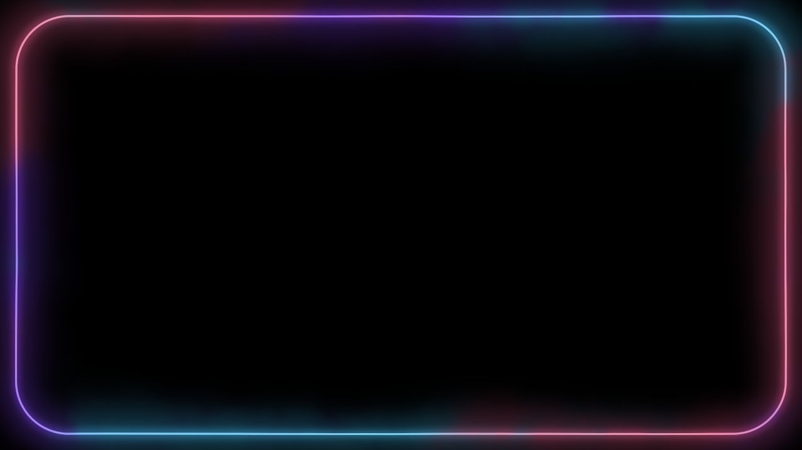
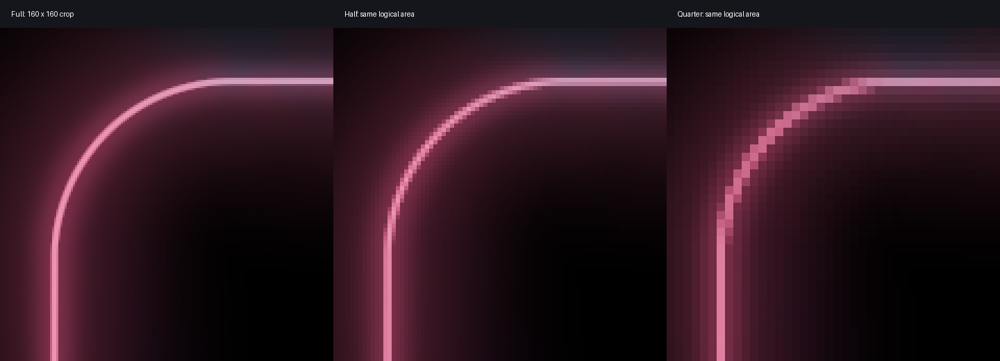

# Shader quality: measured causes and fixes

The investigation found a runtime sampling bug as well as distinct shader
authoring problems. The runtime was creating wgpu's default **nearest** sampler
despite [ADR-0011](adr/0011-shader-abi-v1-core.md) specifying linear filtering.
The fix explicitly sets linear minification/magnification and clamp-to-edge.
Procedural edges and noise need their own sampling treatment; the sampler fix
cannot correct a hard `step()`, an unresolved noise octave, or values already
quantized at an 8-bpc intermediate boundary.

There was no user-provided failing shader. The new
[`siri-glow.glsl`](../examples/siri-glow.glsl) is a concrete complex test: an
animated multicolor rounded-screen rim, continuous fluid field, narrow contour,
soft halo and subtle dither. It uses Apple's publicly documented glowing-edge
Siri motif as a visual direction. It is **not a verified iOS 27 reproduction**;
the primary reference describes the glowing-edge design introduced in 2024.
[Apple's design announcement](https://www.apple.com/newsroom/2024/06/introducing-apple-intelligence-for-iphone-ipad-and-mac/)

## Findings tied to code

| Stage | Evidence | Consequence and action |
|---|---|---|
| Runtime texture sampling | Historical `src/render.rs::ensure_frame_cache` used `SamplerDescriptor::default()`; wgpu 29 defaults each filter to Nearest, even though the binding layout says Filtering | Fractional coordinates jump between source texels. Explicit Linear restores ADR-0011. |
| Procedural contour | A fullscreen triangle uses one sample per output pixel; `step()` computes point coverage | Use `fwidth(d)` coverage for signed distances. Geometry uses logical pixels, coverage uses the actual output footprint. |
| Preview scale | `u_resolution` is logical/full size under ADR-0029, whereas the rasterized textures are physical/current preview size | A fixed `1/u_resolution` AA width becomes too narrow at Half/Quarter. `textureSize` gives source texels; derivatives give output footprint. |
| Noise cells | A raw lattice hash is constant per cell; weak interpolation exposes grid structure | Hash corners consistently, interpolate, and separate the smooth flow field from final per-pixel grain. |
| High-frequency noise | Fixed octaves can exceed the output's sampling capacity, especially under downsample or warp | Attenuate octaves using transformed coordinate derivatives. More detail is not automatically better. |
| 8-bpc graph precision | `Depth::U8` stores every pass in `Rgba8Unorm`; `U15/F32` use `Rgba32Float` | Amplification/thresholding reveals lost low-amplitude levels. Use 16/32-bpc for smooth intermediate fields. |
| Packed thermal field | `apple-thermal.glsl` filtered RG where G is `fract(T*8)` before decoding | Fractional low-channel wraps create false temperature bands. Decode and premultiply four texels before interpolation. |
| Blur/palette/post-processing | Sparse blur taps and nonlinear contrast can reveal or introduce frequencies after the original field | Inspect the scalar field before mapping/thresholding, and test tap density. No evidence here justifies calling every block a runtime tile defect. |

The fixed renderer still has one mip level and one sample per pixel. There is
no implicit mip pyramid or automatic procedural antialiasing. The runtime
preserves AE's supplied alpha and working-space values, so the shader owns
correct compositing math. [The GLSL specification](https://registry.khronos.org/OpenGL/specs/gl/GLSLangSpec.4.60.pdf)
defines derivatives and `smoothstep`; [PBRT's noise chapter](https://www.pbr-book.org/3ed-2018/Texture/Noise)
explains interpolation and footprint-based fBm filtering; [WebGPU's sampler
descriptor](https://gpuweb.github.io/gpuweb/#dictdef-gpusamplerdescriptor)
defines the nearest default and explicit filter modes.

## Quantitative verification

The [headless runner](../scripts/quality/README.md) directly includes production
frontend, planning and rendering modules. The baseline uses `render.rs` from
`d4477ab`; the improved executable uses the working-tree renderer. Both run
identical generated GLSL fixtures through naga → SPIR-V → wgpu → Metal on the
local **Apple M5**. These are GPU measurements, **not an AE-host PASS**.
The 16-bpc rows inspect f32 working data, before AE's final U15 conversion.
Sampler probes cover constant-center sampling, quarter-texel offsets at native
scale and LUT magnification. The code sets both min/mag filters to Linear,
but independent texture minification was **NOT_RUN**; procedural Half/Quarter
outputs do not establish that separate filter behavior.

| Probe | Before / unfiltered | Fixed / filtered |
|---|---:|---:|
| 2×2 black/white checker center, expected 0.5, F32 | 0.0 | 0.5 |
| Quarter-texel checker displacement, mean error, F32 | 0.25 | 0.0 |
| 256-texel ramp → 1024 pixels, mean error, F32 | 0.00097656 | 0.0000000136 |
| Ramp distinct sampled values, F32 | 256 | 1022 (two clamped endpoint pairs) |
| Circle vs 8×8 coverage reference, Full mean error | 0.00163466 | 0.00050750 (−69.0%) |
| Same circle at Half / Quarter | hard point coverage | error −68.3% / −70.2% |
| fBm vs 8×8 supersampled unfiltered reference, RMSE | 0.02698049 | 0.02040683 (−24.4%) |
| Mean pixel jump at lattice borders | 0.333624 raw cell hash | 0.00001084 quintic interpolation |
| 0–0.01 intermediate amplified ×100, distinct output levels | 4 at 8-bpc | 1024 at 16/32-bpc |
| Same amplified field, mean error | 0.09632260 at 8-bpc | 0.0000000098 at 16/32-bpc |
| Packed-temperature midpoint, expected 0.125, mean error | 0.0625 if filtering encoded RG | 0.0 after decoding texels first |

Eight-bit final output still has 256 levels: linear sampling cannot create more
representable output levels in an 8-bit target. The 2×2 center becomes 128/255,
the expected quantized result. That limitation is separate from the fixed
nearest-sampler bug.

The complete new example rendered at 1280×720, times 0/2/4 seconds, 8/16/32-bpc
working formats, and at 640×360/320×180 with the logical canvas fixed to
1280×720. Every component was finite. Half/Quarter RGB mean error against
box-reduced Full output was 0.000380/0.000599; 99th-percentile absolute error
was 0.00535/0.01577. These are close, not pixel-identical, since each preview
has a different coverage footprint and final per-pixel dither.

## Native AE confirmation

The subsequent [native AE 2026 gate](audits/evidence/macos-arm64-20260908/README.md)
passed on the final installed ARM/Metal plugin. It also found and fixed a
separate 0.0.6 host-geometry regression: logical layer sizes were being treated
as physical Half/Quarter canvas sizes. Real viewports now retain the complete
Siri rim at all three resolutions. Independent aerender exports passed
39 checks, including every pixel of an odd-size UV ramp. Native U8 Siri versus
the same-time production float image differed by no more than half an U8 level;
this supports the shader/render output, without asserting general AE color
management or transparent-alpha equivalence.

## Changes delivered

- Explicit linear/clamp runtime sampler, preserving the existing ABI.
- Correct packed-field reads in `apple-thermal.glsl`: exact texel reads at
  same-pixel decode sites, decode-before-filter at fractional blur taps.
- A complete single-pass `siri-glow.glsl`, using integer hashing, quintic
  interpolation, derivative-based octave attenuation and edge coverage, and
  final sub-LSB dither. It adds no Shader ABI or graph feature.
- Required quality guidance in the [authoring skill](../skills/dynamicfx-shaders/quality.md),
  including diagnostics, examples, compositing and acceptance requirements.
- Repeatable [GPU fixtures and numeric gates](../scripts/quality/), with raw
  outputs and a compact [evidence record](audits/evidence/shader-quality-20260908/README.md).

## Failures retained and limits

The first headless launch inside the filesystem sandbox could not enumerate
Metal adapters. The same executable with local GPU access selected Apple M5
and rendered successfully. This is an execution-permission boundary, not
evidence that the hardware lacks Metal support.

The first LUT fixture omitted its `hint:gradient` declaration and was rejected
by the real graph parser. That harness error was corrected; the failure log is
retained. The first noise cutoff (0.18–0.55 lattice units/pixel) removed too much
real detail and increased reference error. Three revised cutoffs were measured;
0.75–2.0 reduced the final noise fixture error by 24.4%. This is why a visually
plausible filter is not accepted solely because it compiles.

These measurements cover the named fixtures and parameters, not all possible
AI-authored shaders. Octave attenuation is approximate, not an exact universal
low-pass filter. Nonlinear operations after it may need further filtering.
Color-management equivalence, final AE alpha behavior, temporal motion quality
and acceptance on other GPUs require their own host evidence. Historical
example screenshots remain historical; new sampler behavior can improve their
appearance without being pixel-identical to old nearest-filter renders.
