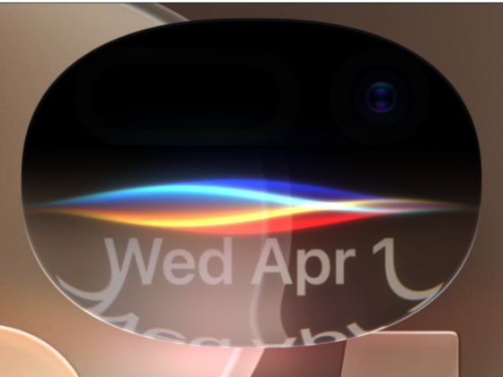

# IOS27Siri

An editable, independently reconstructed Siri-inspired glass and ribbon study
for DynamicFX 0.1.1 and After Effects 2026. This is an approximation based on a
visual reference, not Apple's source or an exact reproduction.

[Watch the native 60 fps preview](preview.mp4).

## Open the sample

1. Install the Windows x64 DynamicFX 0.1.1 release and open `IOS27Siri.aep`.
2. Keep the adjacent `assets` folder with the project. No extra plug-ins,
   fonts, animation data textures or services are required for the visible result.
3. Open `IOS27Siri` for the 1170 × 2532 master, or `IOS27Siri - Detail` for
   the enlarged glass. Both run for five seconds at 60 fps; the project uses
   16 bpc. Cache the preview before judging playback speed.
4. Select the top layer in the master to edit DynamicFx. Its embedded Source
   matches [`siri-reference.glsl`](../siri-reference.glsl).

The project is reduced to the current composition and its dependencies;
historical studies and missing reference footage are excluded. Relocating the
folder was tested in AE 2026, including matching rendered pixels.

## Controls

| Control | Behavior |
|---|---|
| Activation / Wave Amp | Initial reveal and ribbon expansion; editable keyframes |
| Ribbon Flow / Ribbon Phase | Overall flow speed and starting orientation |
| Phase Settling | Small initial convergence; independent slow phase offsets remain afterward |
| Sheet Separation / Ribbon Spread | Spatial separation and wave height |
| Ribbon Transmission / Ribbon Sheen | Colored body falloff and surface highlight |
| Ribbon Blue / Cyan / Yellow / Red | Four editable sheet colors |
| Glass Breath / Breath Rate | Smooth expansion and contraction |
| Glass Center / Pill Center | Geometry location in the master composition |

The shader evaluates motion directly from time, with no sampled animation
table or endpoint hold. The timeline can be extended, but the supplied preview
is not intended as a seamless loop. See [the shader guide](../siri-reference.md)
for standalone use and parameter details.

The included background images are the visual plate from the supplied study;
the GLSL implementation is independent. Apple and Siri names identify the
visual reference; this sample is not affiliated with or endorsed by Apple.
The native preview demonstrates rendered motion, not guaranteed real-time GPU
performance. Shape, brightness and glass details still differ from the reference.
The historical 32-bpc native PNG export issue is outside this 16-bpc sample.

Keep a copy of your shader before editing Source: the known single-Undo/Redo
limitation remains in DynamicFX 0.1.1.
